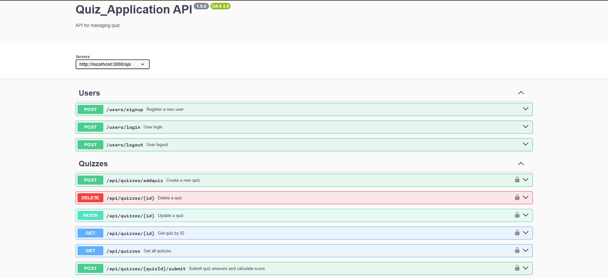

<h1 align="center">MERN-Backend Quiz_Application</h1>


About This project:

-   ⚛️ Tech Stack:  Node.js, Express.js, MongoDB
-   🔐 Authentication with JWT
-   🔐 Authentication & Authorizations 
-   🎬 Create Quiz , Delete & Update By Admin
-   🎬 User can get All quiz & By id get
-   🎬  User Submit quiz answers and calculate score
-   🐱‍👤 Get Similar Quiz Creation API
-   🐱‍👤 Swagger for API Documentation


## Expense Swagger UI


### Setup .env file

```bash
DATABASE_URL=Your_mongo_url
PORT=Sevice_port
NODE_ENV=NODE_ENVIRINMENT
JWT_SECRET=jwt_secret
```

### Run this app locally

```shell
npm run build
```

### Start the app

```shell
npm start
```
